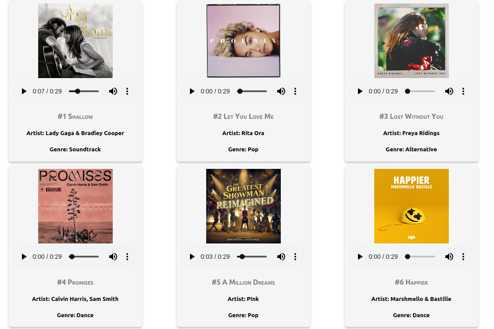

# Top 20 songs in UK app

This project was bootstrapped with [Create React App](https://github.com/facebook/create-react-app).

## About the app

This apps shows the 20 top songs in the UK. Made in an evening the objective of the project was to practise with React components and requests.

## APIs

This apps uses the [iTunes API](https://itunes.apple.com/gb/rss/topsongs/limit=20/json)

